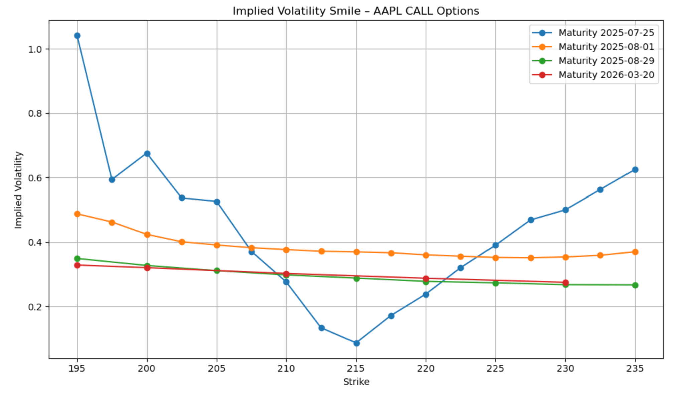
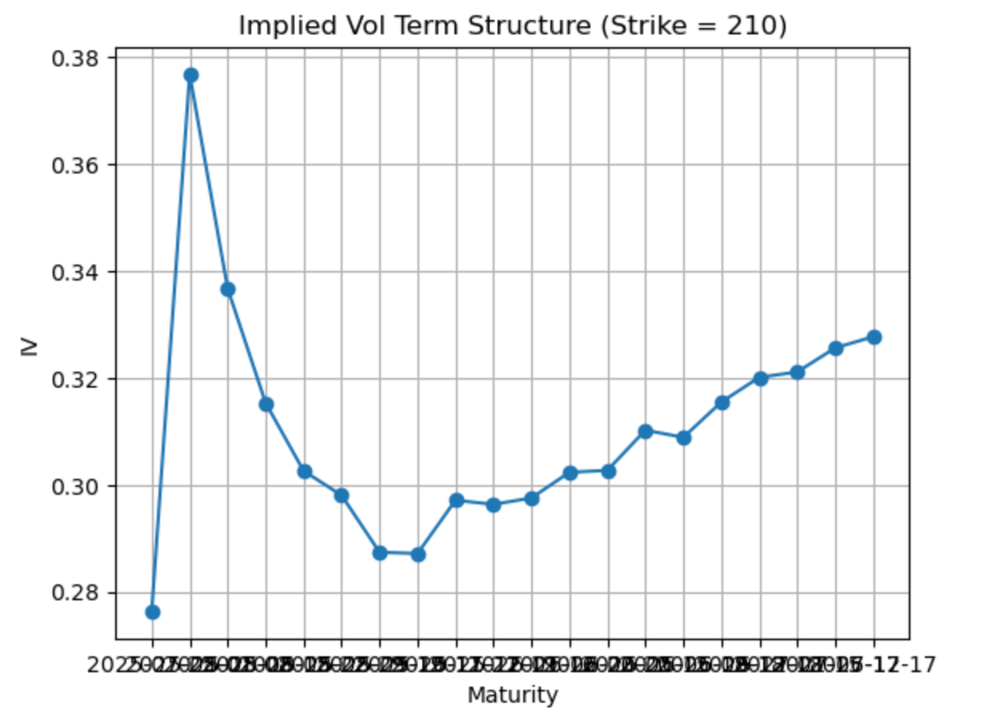

# AAPL Option Pricing & Implied Volatility Analysis

## Objective

This project focuses on pricing European call options on Apple (AAPL) using the Black-Scholes model. It covers the full implied volatility workflow:

- Retrieve real market data using Yahoo Finance
- Filter and clean option chains
- Plot volatility smiles and term structures
- Invert Black-Scholes to compute implied volatility using Newton's method
- Compare market IVs vs model-based IVs
- Recalculate theoretical prices using your own IV estimates

---

## Tools & Libraries

- Python 3
- `yfinance`
- `pandas`
- `numpy`
- `scipy`
- `matplotlib`

---

## Step-by-Step Breakdown

### 1. **Data Retrieval**
- Spot price from Yahoo Finance
- Full option chain with available maturities
- Focus on CALL options only

### 2. **Filtering Liquid Options**
Criteria:
- Volume > 10  
- Last price > 0  
- IV > 0  
- Strike within ±10% of spot  

A new column `expiration` is added manually.

### 3. **Volatility Smile**
Plot implied volatility vs. strike price for several maturities:



### 4. **Term Structure**
Fix a strike (e.g., 210) and plot IV across maturities:



### 5. **Implied Volatility Calculation (Newton Method)**
Invert Black-Scholes using market price to estimate `impliedVol_calc`.

```python
calls_liq['impliedVol_calc'] = calls_liq.apply(compute_iv, axis=1)
